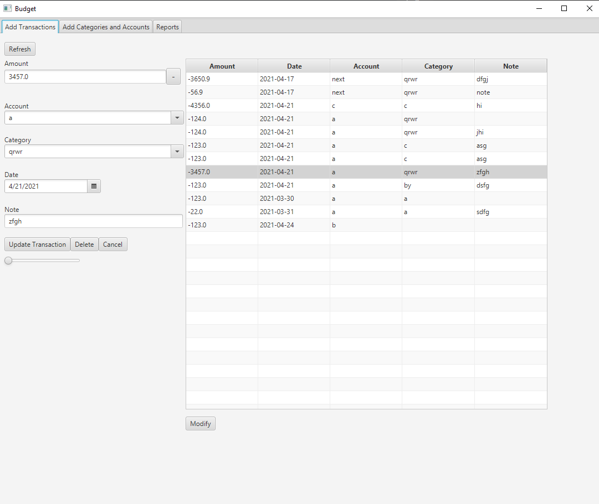
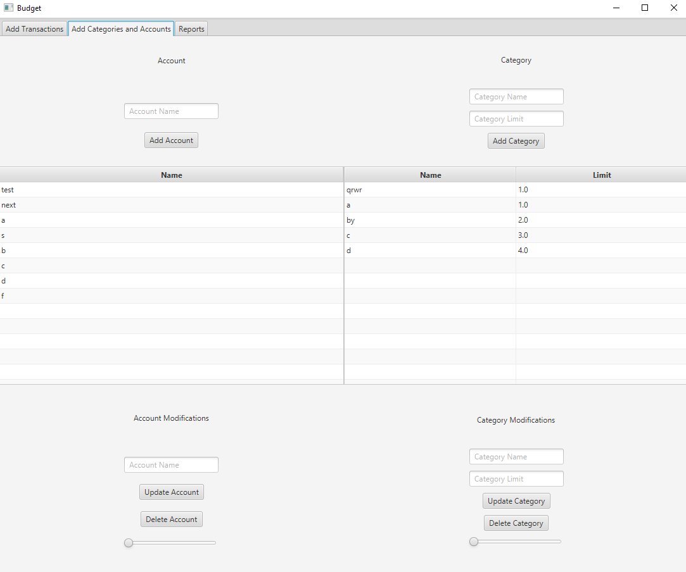

<h1>What is this?</h1>
Budget software made with Java, JavaFX, and SQLite. This project will update over time. 
There is a page to add and edit transactions. Transactions include an amount, positive or negative, a category, an account, a date and a description. The date field automatically loads the current date. Transactions page includes a list of transactions that updates in realtime. If you make a mistake you can easily edit your transaction from the same page. 
There is a page to manage categories and accounts. Accounts and categories can have names and money goals or limits. 
There is a page to view your spending habits by category and account. You can choose a date range.

<h3>Add transaction page</h3>

<h3>Manage transaction page</h3>

<h3>Add and manage categories and accounts page</h3>

<h3>Reports page</h3>

